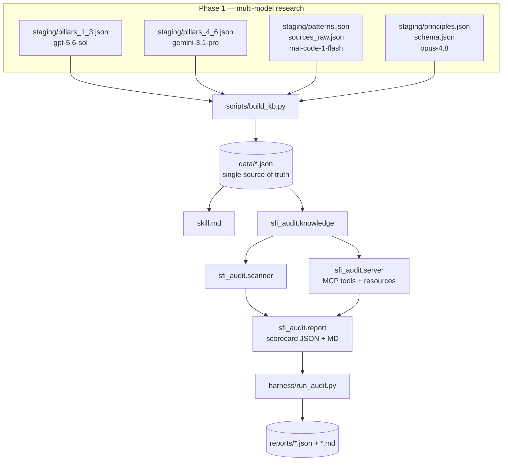

# ARCHITECTURE

The SFI audit system has one **source of truth** (`data/*.json`) consumed by
three surfaces: the **skill**, the **MCP server**, and the **harness**. This
keeps human guidance and automated checks from ever drifting apart.

## Data flow



## Components

| Path | Responsibility |
| ---- | -------------- |
| `data/*.json` | Canonical KB: pillars, checklists, principles, patterns, sources |
| `scripts/build_kb.py` | Deterministically synthesize `staging/` → `data/` (stdlib only) |
| `mcp_server/sfi_audit/knowledge.py` | Locate, load, cache, and query the KB |
| `mcp_server/sfi_audit/matching.py` | Classify tokens (regex vs literal), match lines, redact secrets |
| `mcp_server/sfi_audit/scanner.py` | Read-only repo walk + per-criterion evaluation |
| `mcp_server/sfi_audit/checks/structural.py` | 5 deterministic structural checks |
| `mcp_server/sfi_audit/report.py` | Build per-pillar scorecard (JSON + Markdown) |
| `mcp_server/sfi_audit/server.py` | FastMCP entrypoint: 12 tools, 3 resources |
| `harness/run_audit.py` | CLI over `report.generate_scorecard`; `--self` dogfood |
| `harness/fixtures/` | Golden compliant + non-compliant repos with `expected.json` |
| `mcp_server/tests/` | Knowledge integrity, matching, scanner regression, server smoke |

## Knowledge-base schema (per pillar)

`id`, `slug`, `name`, `statement`, `zero_trust{verify_explicitly,
use_least_privilege, assume_breach}`, `nist_csf_functions[]`, `nist_csf_detail`,
`objectives[]`, `best_practices[]`, and `audit_criteria[]`. Each criterion has
`id`, `requirement`, `rationale`, `how_to_verify`, `severity`
(`critical|high|medium|low`), `signals[]`, `anti_signals[]`, and `source_url`.
`sfi_checklists.json` is the flattened, scanner-ready view keyed by
`<pillar-slug>/<criterion-id>`.

## Scanner algorithm

1. **Walk** the target directory read-only. Skip VCS/build/vendor dirs and any
   caller-supplied `exclude` prefixes (matched case-insensitively, with `./` and
   backslashes normalized); skip **reparse points** — POSIX symlinks *and* Windows
   junctions/mount points — and enforce a `resolve().relative_to(root)` boundary so
   the walk can never escape the repository; skip binary and oversized files; cap
   total files/bytes so scans stay bounded and set a `truncated` flag when a cap is
   hit. A separate names-only pass (`all_paths`) feeds presence/absence checks so a
   tracked-but-oversized `.env` cannot slip past them.
2. **Match** each file's lines against every criterion's compiled `signals` and
   `anti_signals`.
   - A token is treated as a **regex** if it contains regex metacharacters
     (`\d`, `[...]`, `(?:` , `{n}`, `|`, quantified groups); otherwise it is a
     **case-insensitive literal substring**. A lone `.` stays literal.
   - Regexes are **case-sensitive**; use inline `(?i)` and `\b…\b` for
     word-anchored, case-insensitive matches (e.g. `(?i)\bMD5\b`).
3. **Resolve status** per criterion: `fail` if any anti-signal hit; else `pass`
   if any signal hit; else `manual`.
4. **Merge structural checks** (tracked `.env`, unpinned CI actions, unpinned
   dependencies, CODEOWNERS, SECURITY.md) — deterministic, high-confidence.
   `CODEOWNERS`/`SECURITY.md` count only where the platform honors them (repo
   root, `.github/`, or `docs/`), and `CODEOWNERS` must carry a real `@`-owner
   rule; npm deps are pinned only at **exact semver** (non-registry specs are out
   of scope) and pip `-r`/`-c` includes are followed (cycle-guarded) so they
   cannot hide unpinned requirements.
5. **Redact** every evidence snippet before returning: standalone secret formats
   (PEM headers, AWS/GitHub/Slack/Google/OpenAI keys, JWTs, `Bearer <token>`) are
   masked wherever they appear, in addition to quoted and `=`/`:`-assigned values.
6. **Write boundary.** `generate_scorecard` refuses to write its output at or
   under the audited root (which would mutate the scanned tree) unless
   `allow_in_tree=True` — used only by the in-repo `--self --out reports` dogfood.

### Matching limitations (by design)
These bound what a `pass`/`fail` can mean; the KB is written to respect them:
- **Content-based, not path-based.** Tokens match file *contents*, never file
  names or globs. Filename/glob signals (`**/*.tf`, `.github/**/codeql.yml`) never
  match and are expressed as content markers (`resource "`, `github/codeql-action`).
- **Per-line, single-line.** Matching is line-by-line; constructs spanning
  multiple lines are not detected.
- **Heuristic.** Signals are indicators, not proofs; `manual` (undetermined) is
  the honest default and is excluded from scoring.
- **Working tree, not VCS/runtime.** Structural checks read files on disk, not git
  history, server-side branch protection, or CI runtime state.
- **Reparse points are not followed.** Symlinks *and* Windows junctions/mount
  points are skipped and a `resolve().relative_to(root)` boundary is enforced, so a
  scan always stays inside the repository.
- **Bounded, and honest about it.** Caps keep scans finite. A **single walk**
  feeds both the content view (`files`) and the name view (`all_paths`), so
  `files ⊆ all_paths` always holds; when a cap truncates the walk the result
  carries `scanned.truncated = true`, the scorecard sets `overall.incomplete` and
  renders an **"Incomplete scan"** banner, so absence-based `pass` results are
  treated as provisional. Presence/absence checks see every file *name* (via
  `all_paths`), so an oversized or binary tracked file is still caught.
- **Undetermined ⇒ `manual`, never a false pass.** When a structural control
  cannot be verified from what was scanned — an unresolved pip `-r`/`-c` include
  (missing/oversized/external), or a `CODEOWNERS` too large/binary to read — the
  check returns `manual` (excluded from scoring) rather than a clean `pass`.

### Scoring
`score = 100 × earned / possible` over **determined** criteria (pass + fail);
`manual` is excluded from the denominator. Severity weights: critical 5, high 3,
medium 2, low 1. Grades: A ≥ 90, B ≥ 80, C ≥ 70, D ≥ 60, else F. Pillars with
only manual items score `N/A`.

## Deployment

The server speaks MCP over **stdio** (`python -m sfi_audit.server`). Register it
with the Copilot CLI (which reads `~/.copilot/mcp-config.json`). The supported,
version-agnostic way is the CLI's own `mcp add` command:

```powershell
copilot mcp add sfi-audit `
  --env "PYTHONPATH=C:\GitHub Copilot Projects\SFI\mcp_server" `
  --env "SFI_DATA_DIR=C:\GitHub Copilot Projects\SFI\data" `
  --tools "*" `
  -- "C:\GitHub Copilot Projects\SFI\.venv\Scripts\python.exe" -m sfi_audit.server
```

Everything after `--` is the local stdio launch command. This writes the
following entry to `~/.copilot/mcp-config.json` (you can also author it by hand):

```json
{
  "mcpServers": {
    "sfi-audit": {
      "type": "local",
      "tools": ["*"],
      "command": "C:\\GitHub Copilot Projects\\SFI\\.venv\\Scripts\\python.exe",
      "args": ["-m", "sfi_audit.server"],
      "env": {
        "PYTHONPATH": "C:\\GitHub Copilot Projects\\SFI\\mcp_server",
        "SFI_DATA_DIR": "C:\\GitHub Copilot Projects\\SFI\\data"
      }
    }
  }
}
```

- `PYTHONPATH` makes `sfi_audit` importable without an install; if you ran
  `pip install -e mcp_server` into the venv it is optional.
- `SFI_DATA_DIR` pins the knowledge base explicitly (otherwise the server
  searches ancestor directories for `data/sfi_pillars.json`).
- Inspect/verify with `copilot mcp get sfi-audit --show-secrets`,
  list with `copilot mcp list`, and remove with `copilot mcp remove sfi-audit`.
- Restart the client to pick up the server. Verify end-to-end with `server_info`
  and a scan of a scratch dir; a headless check is `harness/e2e_stdio` style
  handshake (initialize -> list_tools -> call_tool) over real stdio transport.

**Portable registration.** The `command`/`env` paths above are **machine-local by
design** — they point at this checkout's venv and `data/`. To register the server
from any checkout without hand-editing absolute paths, run
`scripts/register_mcp.ps1`: it resolves the interpreter (`.venv` or `PATH`),
`PYTHONPATH`, and `SFI_DATA_DIR` **relative to its own location**, merges the
`sfi-audit` entry into `mcp-config.json` (preserving other servers, backing up
first), and supports `-WhatIf` for a dry run and `-ConfigPath`/`-PythonPath`
overrides.

## Design decisions

- **KB-driven, not code-driven.** Criteria live in data, never hard-coded in the
  scanner, so refreshing SFI guidance never requires touching scanner logic.
- **Signals + anti-signals.** Modeling both positive evidence and violations lets
  the scanner distinguish `pass` from `manual` instead of only flagging bad
  patterns.
- **Manual is first-class.** Tenant/policy/platform controls that aren't visible
  in source are surfaced as `manual` and excluded from scoring, so unknowns never
  fake a passing grade.
- **Dogfooding.** `run_audit.py --self` audits this repo; the KB, staging, and
  deliberately-insecure fixtures are excluded so the tool doesn't flag its own
  detection vocabulary. This repo self-audits **A / 100** with 0 findings.
- **Multi-model build.** The v1.0.0 KB was extracted by four models in parallel
  into disjoint staging fragments, then reconciled by `build_kb.py`. See
  [`PROVENANCE.md`](./PROVENANCE.md).
